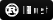

 

[<picture><source media="(prefers-color-scheme: dark)" srcset="./assets/badge-linkedin-dark.svg"></picture>](https://www.linkedin.com/in/friedrich-z)
[<picture><source media="(prefers-color-scheme: dark)" srcset="./assets/badge-keyoxide-dark.svg"></picture>](https://keyoxide.frizim.com/dev%40frizim.com)
## Über Mich
- Arbeite hauptsächlich mit:  <picture><source media="(prefers-color-scheme: dark)" srcset="./assets/badge-java-dark.svg"></picture> <picture><source media="(prefers-color-scheme: dark)" srcset="./assets/badge-javascript-dark.svg"></picture> <picture><source media="(prefers-color-scheme: dark)" srcset="./assets/badge-typescript-dark.svg"></picture> <picture><source media="(prefers-color-scheme: dark)" srcset="./assets/badge-php-dark.svg"></picture> <picture><source media="(prefers-color-scheme: dark)" srcset="./assets/badge-sql-dark.svg"></picture> <picture><source media="(prefers-color-scheme: dark)" srcset="./assets/badge-html-dark.svg"></picture> <picture><source media="(prefers-color-scheme: dark)" srcset="./assets/badge-css-dark.svg"></picture>
- ...gelegentlich auch:  <picture><source media="(prefers-color-scheme: dark)" srcset="./assets/badge-python-dark.svg"></picture> <picture><source media="(prefers-color-scheme: dark)" srcset="./assets/badge-kotlin-dark.svg"></picture> <picture><source media="(prefers-color-scheme: dark)" srcset="./assets/badge-latex-dark.svg"></picture> <picture><source media="(prefers-color-scheme: dark)" srcset="./assets/badge-nix-dark.svg"></picture>
- Lerne momentan:  <picture><source media="(prefers-color-scheme: dark)" srcset="./assets/badge-rust-dark.svg"></picture> <picture><source media="(prefers-color-scheme: dark)" srcset="./assets/badge-quarkus-dark.svg"></picture> <picture><source media="(prefers-color-scheme: dark)" srcset="./assets/badge-c++-dark.svg"></picture>
- Tools meiner Wahl:  <picture><source media="(prefers-color-scheme: dark)" srcset="./assets/badge-maven-dark.svg"></picture> <picture><source media="(prefers-color-scheme: dark)" srcset="./assets/badge-gradle-dark.svg"></picture> <picture><source media="(prefers-color-scheme: dark)" srcset="./assets/badge-cmake-dark.svg"></picture> <picture><source media="(prefers-color-scheme: dark)" srcset="./assets/badge-vscode-dark.svg"></picture> <picture><source media="(prefers-color-scheme: dark)" srcset="./assets/badge-sonarlint-dark.svg"></picture> <picture><source media="(prefers-color-scheme: dark)" srcset="./assets/badge-nixos-dark.svg"></picture> <picture><source media="(prefers-color-scheme: dark)" srcset="./assets/badge-archlinux-dark.svg"></picture> <picture><source media="(prefers-color-scheme: dark)" srcset="./assets/badge-docker-dark.svg"></picture> <picture><source media="(prefers-color-scheme: dark)" srcset="./assets/badge-debian-dark.svg"></picture>
- Fullstack-Webentwickler
- Anwendungsentwickler für Linux &amp; Windows
- ~~Paranoid~~ Cybersecurity-Enthusiast mit großem Interesse an Security by Design und Kryptographie
- Erweitere ständig mein Wissen
- Weitere Interessen: Elektronik (IoT, Mikrocontroller), konstruierte Sprachen, Gaming, ...

## Projekte
Schaut euch gerne meine momentanen Projekte an. Ich freue mich über Feedback, Bugreports und Pull Requests.
| Name | Status | Link |
| ----------------------------- | --------------------------- | ---- |
| Wemorize - Webbasierte Community-Lernplattform | In Arbeit |  |
| IronGate - Authentifizierungs- und Rechteverwaltungs-Framework | In Arbeit |  |
| Everytask - Online-Kalender für Teams | In Arbeit |  |

## Meine GitHub-Statistik

